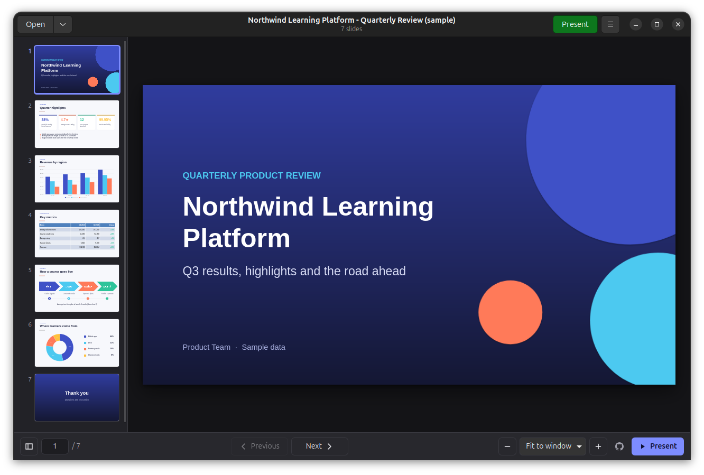
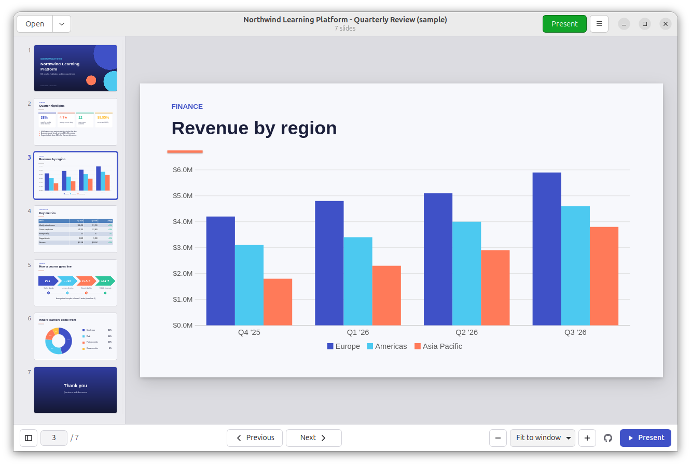
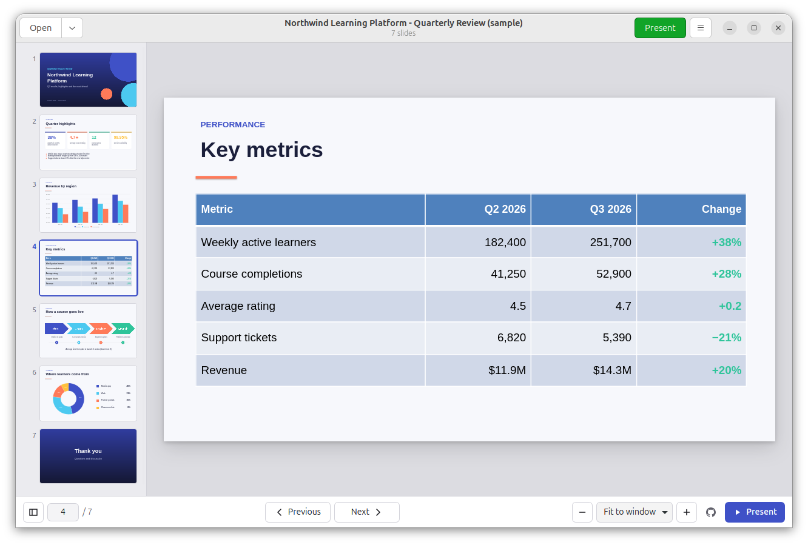
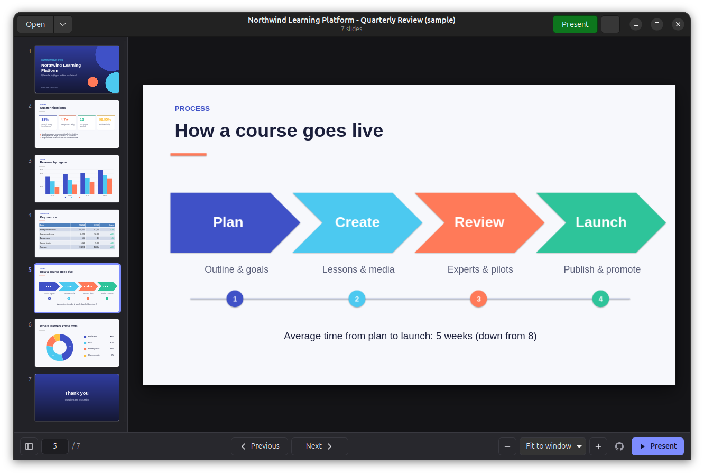
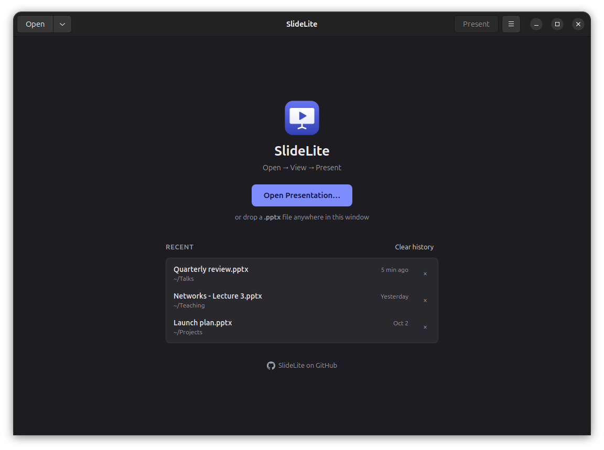

<p align="center">
  
</p>

<h1 align="center">SlideLite</h1>

<p align="center">
  A lightweight, fast, offline <strong>PowerPoint (.pptx) viewer for Ubuntu</strong>.<br>
  <em>Open → View → Present.</em>
</p>

<p align="center">
  <a href="https://github.com/ammarqaisar11a55/SlideLite-Lightweight-PPTX-Viewer-for-Ubuntu/actions/workflows/ci.yml"></a>
  <a href="https://github.com/ammarqaisar11a55/SlideLite-Lightweight-PPTX-Viewer-for-Ubuntu/releases/latest"></a>
  
</p>

SlideLite opens PowerPoint presentations and presents them, with no office suite to
install. It is a **viewer only**: it never modifies your presentation, never runs
macros, and never touches the network.



| Charts | Tables |
|---|---|
|  |  |

| Diagrams | Welcome screen and recent files |
|---|---|
|  |  |


<sub>Screenshots use the synthetic sample deck [`docs/showcase.pptx`](docs/showcase.pptx).</sub>

## Features

**Rendering**
- Themes, slide masters and layouts with full placeholder inheritance (positions, list
  styles, colour maps, theme fonts and colours, background styles)
- Rich text: fonts, sizes, bold/italic/underline/strikethrough, colour, highlight,
  superscript/subscript, letter spacing, caps, alignment, line and paragraph spacing,
  bullets (including Wingdings/Symbol bullets), numbered lists, indentation, vertical and
  rotated text, columns, autofit and hyperlinks
- All 187 PowerPoint preset shapes, evaluated from the ECMA-376 shape definitions, plus
  custom (freeform) geometry, connectors and arrowheads
- Solid, gradient, pattern and picture fills; transparency; dashed lines; shadows, glow
  and reflection; rotation and flips
- Pictures with cropping, clipping to shapes and colour effects (grayscale, duotone,
  brightness/contrast); SVG images
- **EMF/WMF metafiles** (clip art, diagrams and OLE previews) converted to SVG
- Tables with merged cells, cell styling and all 74 built-in PowerPoint table styles
- Charts: column/bar (clustered, stacked, 100%), line, area, pie, doughnut, scatter,
  bubble, radar and combo charts with axes, gridlines, legends, titles, data labels and
  number formats
- SmartArt (drawn from PowerPoint's own diagram layout), groups and nested groups
- 4:3, 16:9 and custom slide sizes

**Viewing**
- Thumbnail sidebar with lazy loading (large decks stay fast)
- Zoom: fit to window, fit to width, 50–200% presets, custom zoom, Ctrl + mouse wheel
- Go to slide, keyboard navigation, light / dark / system theme (slides are never themed)
- Recent presentations (local only) with remove and clear
- Open from the app, by double-clicking a file, with drag and drop, from the file manager's
  *Open With*, or from the command line

**Presenting**
- Fullscreen slide show that skips hidden slides
- Slide transitions: fade, push, wipe, split, cover, uncover, cut, zoom, circle, diamond,
  plus, wedge, wheel, random bars, blinds, checkerboard, dissolve, strips and more, with
  automatic fallbacks for effects that aren't implemented
- Build animations: entrance, exit, emphasis and motion paths (appear, fade, fly in,
  wipe, split, box, zoom, ascend, spin, grow/shrink…), on click or automatically
- Rehearsed timings (auto-advance), loop mode, black/white screen, end-of-show screen

## Supported formats

| Format | Support |
|---|---|
| `.pptx` PowerPoint presentation | ✅ Full |
| `.ppsx` PowerPoint show | ✅ Opens directly in the slide show |
| `.pptm` macro-enabled presentation | ✅ Displayed; **macros are never run** |
| `.potx` template | ✅ Displayed |
| `.ppt` PowerPoint 97–2003 | ❌ Detected and explained (save as .pptx) |
| Password-protected files | ❌ Detected and explained |

## Installation

Download `slidelite_<version>_all.deb` from the
[latest release](https://github.com/ammarqaisar11a55/SlideLite-Lightweight-PPTX-Viewer-for-Ubuntu/releases/latest), then:

```bash
sudo apt install ./slidelite_1.0.0_all.deb
```

This installs a desktop entry, so SlideLite appears in your applications and in
*Open With* for PowerPoint files. To make it the default viewer, right-click a `.pptx`
file → *Properties* → *Open With* → **SlideLite** → *Set as default*.

Requirements: Ubuntu 24.04 or newer (or another Debian-based distribution with GTK 3 and
WebKitGTK 4.1). Recommended fonts (`fonts-crosextra-carlito`, `fonts-crosextra-caladea`,
`fonts-liberation`) are metric-compatible with Calibri, Cambria, Arial and Times New Roman,
so text wraps like it does in PowerPoint. They are installed automatically as
recommendations.

## Usage

```bash
slidelite                          # welcome screen with recent presentations
slidelite talk.pptx                # open a presentation
slidelite --presentation talk.pptx # start the slide show immediately
slidelite --fullscreen talk.pptx   # open the viewer fullscreen
```

### Keyboard shortcuts

| Viewer | |
|---|---|
| `→` `↓` `Space` `Page Down` | Next slide |
| `←` `↑` `Page Up` | Previous slide |
| `Home` / `End` | First / last slide |
| `Ctrl+G` | Go to slide |
| `Ctrl` `+` / `Ctrl` `−` / `Ctrl+0` | Zoom in / out / fit to window |
| `Ctrl+B` | Toggle thumbnails |
| `F6` | Move between thumbnails, slide and toolbar |
| `Ctrl+O` | Open a presentation |
| `F11` | Fullscreen |
| `F1` | Show all shortcuts |

| Slide show | |
|---|---|
| `F5` / `Shift+F5` | Start from the beginning / current slide |
| `→` `↓` `Space` `Page Down` `Enter`, click | Next animation or slide |
| `←` `↑` `Page Up`, right-click | Previous slide |
| `Home` / `End` | First / last slide |
| number + `Enter` | Go to that slide |
| `B` / `W` | Black / white screen |
| `Esc` | End the slide show |

## Limitations

SlideLite aims for high fidelity but is **not** a pixel-perfect PowerPoint clone. Known
limitations:

- **Audio and video are not played.** Media shows its poster frame (the picture
  PowerPoint stores for it).
- **Fonts:** text is laid out by WebKit. When a deck's fonts aren't installed, SlideLite
  substitutes the closest free font, and line breaks can differ slightly. Embedded fonts
  are not used.
- **3D effects** (bevels, extrusion, 3D rotation), artistic picture effects, soft edges,
  inner shadows and WordArt text warps are approximated or ignored.
- **Animations:** effects are matched to the closest implemented effect. Trigger
  (interactive) sequences, sounds and colour-change emphasis effects are not played, and
  "Morph" and some Office 2010+ transitions fall back to simpler ones.
- **Charts** are drawn from the data cached in the file. Uncommon chart types (stock,
  surface, waterfall, sunburst…) use their fallback image or a placeholder.
- **SmartArt** relies on the pre-rendered drawing PowerPoint saves. Files from tools that
  don't write it show the diagram text as a list.
- EMF+ only metafiles (no GDI fallback records) may appear empty. TIFF images need the
  GdkPixbuf TIFF loader.
- Speaker notes, comments and presenter view are not shown.
- Legacy `.ppt` and password-protected files cannot be opened.

## Privacy and security

- **Completely offline:** no accounts, telemetry, analytics or crash uploads. A
  content filter and Content-Security-Policy block every network request, so external
  links in a deck are never fetched.
- Presentations are treated as untrusted input: hardened XML parsing (no DTDs or
  entities), zip-bomb and path-traversal protection, escaped text, and a sandboxed web
  view. Macros, OLE objects and ActiveX controls are never executed.
- Hyperlinks open only after you confirm them.
- The only files SlideLite writes are its own settings (`~/.config/slidelite/`), the
  recent-files list (`~/.local/state/slidelite/`) and a small WebKit content-filter cache
  (`~/.cache/slidelite/`).

## Architecture

SlideLite is a GTK 3 application written in Python. A pure-Python OOXML engine renders each
slide to self-contained HTML/SVG, which the system **WebKitGTK** displays. Nothing is
bundled: GTK, WebKit and GStreamer are already part of the Ubuntu desktop.

```
GTK window ──► hardened WebKit view (viewer UI, thumbnails, slide show, animations)
                 ▲ slidelite:// (in memory, no network)
Python host ──► router ──► document session ──► OOXML engine ──► HTML/SVG renderer
```

See [ARCHITECTURE.md](ARCHITECTURE.md) for the technology evaluation, module map,
security model and performance strategy.

## Development

```bash
sudo apt install python3-gi gir1.2-gtk-3.0 gir1.2-webkit2-4.1 python3-venv nodejs
git clone https://github.com/ammarqaisar11a55/SlideLite-Lightweight-PPTX-Viewer-for-Ubuntu.git
cd SlideLite-Lightweight-PPTX-Viewer-for-Ubuntu
make venv && . .venv/bin/activate   # pytest, ruff and python-pptx (fixtures only)

./bin/slidelite docs/showcase.pptx  # run from source
make test                           # Python tests (GUI tests need a display)
make test-js                        # JavaScript unit tests
make lint                           # ruff
make dev FILE=deck.pptx             # serve the UI on http://127.0.0.1:8765 for browser debugging
```

`SLIDELITE_DEBUG=1` enables the WebKit inspector and logs page messages. See
[CONTRIBUTING.md](CONTRIBUTING.md) for the project layout, tests and commit conventions.

## Building the package

```bash
make deb            # or: packaging/build-deb.sh [output-dir]
```

This produces `slidelite_<version>_all.deb` without needing root. Pushing a tag such as
`v1.0.0` runs the [release workflow](.github/workflows/release.yml), which tests, builds
and publishes the package as a GitHub Release.

An AppImage is not provided: it would have to bundle GTK and WebKitGTK (hundreds of MB),
which defeats the purpose of a lightweight viewer that uses the system libraries.

## License

[MIT](LICENSE) © 2026 Muhammad Ammar Qaisar. Preset shape geometry is derived from
ECMA-376 Part 1, Annex D.
